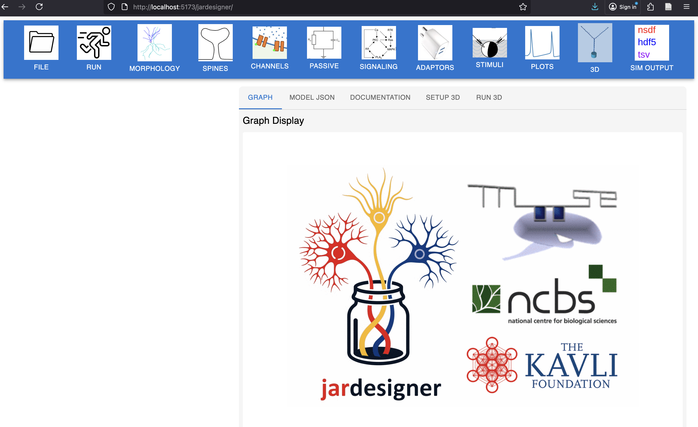

==============
Introduction
==============

`MOOSE, the Simulator <#TOC>`__
'''''''''''''''''''''''''''''''

MOOSE(Multiscale Object Oriented Simulation Environment) is an open source simulation framework for computational modelling in systems biology and neuroscience. It has been designed to simulate neural mechanisms spanning across scales-from single neuron dynamics to large networks of neurons.
   

.. figure:: ../images/Gallery_Moose_Multiscale.png
   :scale: 75%
   :alt: **multiple scales in moose**

   *Multiple scales can be modelled and simulated in MOOSE*

**What can MOOSE do?**
    
 * Multiscale capabilities of MOOSE enables it to simulate stochastic chemical processes, reaction-diffusion systems in a single neuron to multi-compartmental neuron models as well as large-scale biological neural networks.
 * Supports both biochemistry and biophysics for integrated simulations.
 
 * Easily toggles between deterministic and stochastic simulation modes for biochemical models.
 
 * Scalability is achieved through highly efficient built-in solvers with optimised data structures and algorithms, to handle biologically relevant complex models. 
 
 * Above modelling capabilities are enabled using an object-based approach-classes representing biological entities and attributes their biological properties.

 * Available as Pymoose, the Python interface, for seamless user experience.
 
 * Handles multiple model formats such as SBML, NeuroML, and GENESIS (both kkit and cell.p).
 
 * Data can be saved in text, HDF5 based NSDF,or any other format compatible with numpy arrays.

 * The latest feature of MOOSE is ``Jardesigner`` - a web-based platform for multi-scale modelling without the need for any coding.
  
 * MOOSE can also be installed in a Google colab environment or be directly installed as a stand alone version.

 * The current version of MOOSE is v4.1.4, called “Jhangri”, an incremental release over version v4.1.0.
   
 * Over the years, funded by the Kavli Foundation,NCBS, TIFR, DST,DBT, DAE, NIH and currently supported by NCBS and CHINTA.

*Jardesigner: web-based platform*

