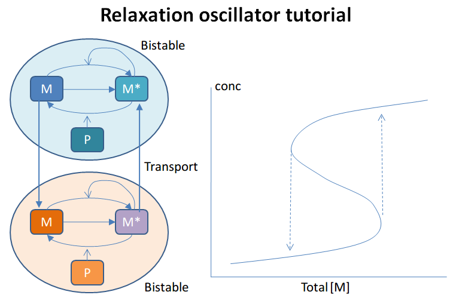
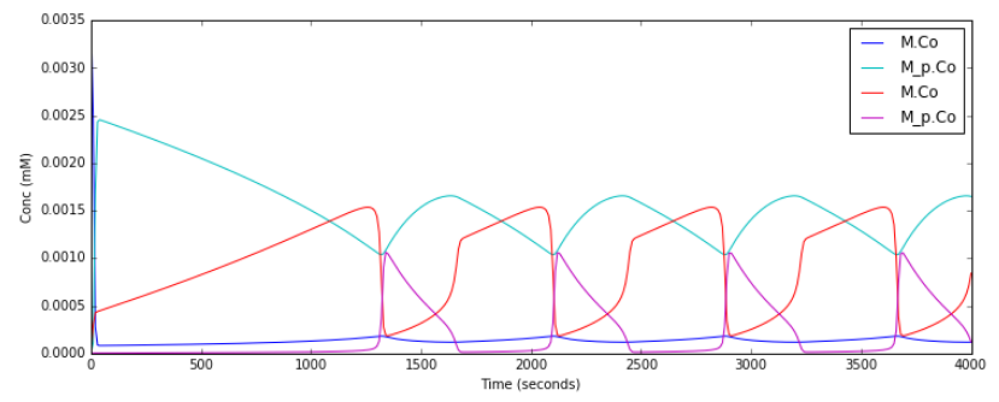
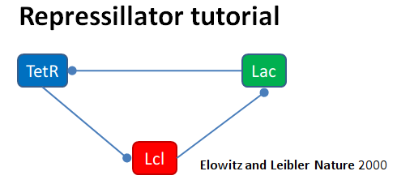
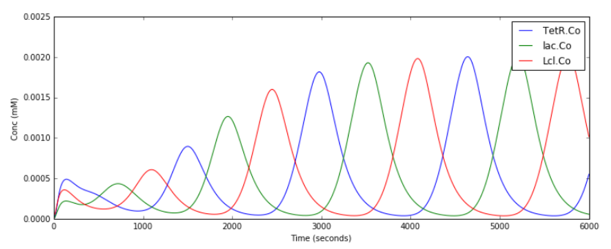

********************
Chemical Oscillators
********************

`Chemical Oscillators <https://en.wikipedia.org/wiki/Chemical_clock>`_, also known as chemical clocks, are chemical systems in which the concentrations of one or more reactants undergoes periodic changes. 

These Oscillatory reactions can be modelled using moose. The examples below demonstrate different types of chemical oscillators, as well as how they can be simulated using moose. Each example has a short description, the code used in the simulation, and the default (gsl solver) output of the code.

Each example can be found as a python file within the main moose folder under 
::

    (...)/moose/moose-examples/tutorials/ChemicalOscillators

In order to run the example, run the script
::

    python filename.py

in command line, where ``filename.py`` is the name of the python file you would like to run. The filenames of each example are written in **bold** at the beginning of their respective sections, and the files themselves can be found in the aformentioned directory.

In chemical models that use solvers, there are optional arguments that allow you to specify which solver you would like to use.
:: 

    python filename.py [gsl | gssa | ee]

Where:

 - gsl: This is the Runge-Kutta-Fehlberg implementation from the GNU Scientific Library (GSL). It is a fifth order variable timestep explicit method. Works well for most reaction systems except if they have very stiff reactions.
 - gssl: Optimized Gillespie stochastic systems algorithm, custom implementation. This uses variable timesteps internally. Note that it slows down with increasing numbers of molecules in each pool. It also slows down, but not so badly, if the number of reactions goes up.
 - Exponential Euler:This methods computes the solution of partial and ordinary differential equations.

All the following examples can be run with either of the three solvers, each of which has different advantages and disadvantages and each of which might produce a slightly different outcome. 

Simply running the file without the optional argument will by default use the ``gsl`` solver. These ``gsl`` outputs are the ones shown below. 

|
|
        
Relaxation Oscillator
=====================

File name: **relaxationOsc.py**

This example illustrates a **Relaxation Oscillator**. This is an
oscillator built around a switching reaction, which tends to flip into
one or other state and stay there. The relaxation bit comes in because
once it is in state 1, a slow (relaxation) process begins which
eventually flips it into state 2, and vice versa.

The model is based on Bhalla, Biophys J. 2011. It is defined in kkit
format. It uses the deterministic gsl solver by default. You can specify
the stochastic Gillespie solver on the command line

::

    ``python relaxationOsc.py gssa``

Things to do with the model:

::

    * Figure out what determines its frequency. You could change
      the initial concentrations of various model entities::
            
        ma = moose.element( '/model/kinetics/A/M' )
        ma.concInit *= 1.5

      Alternatively, you could scale the rates of molecular traffic
      between the compartments::

        exo = moose.element( '/model/kinetics/exo' )
        endo = moose.element( '/model/kinetics/endo' )
        exo.Kf *= 1.0
        endo.Kf *= 1.0

    * Play with stochasticity. The standard thing here is to scale the
      volume up and down::

        compt.volume = 1e-18 
        compt.volume = 1e-20 
        compt.volume = 1e-21 

**Code:**

.. hidden-code-block:: python
    :linenos:
    :label: Show/Hide code

    #########################################################################
    ## This program is part of 'MOOSE', the
    ## Messaging Object Oriented Simulation Environment.
    ##           Copyright (C) 2014 Upinder S. Bhalla. and NCBS
    ## It is made available under the terms of the
    ## GNU Lesser General Public License version 2.1
    ## See the file COPYING.LIB for the full notice.
    #########################################################################
    
    import moose
    import matplotlib.pyplot as plt
    import matplotlib.image as mpimg
    import pylab
    import numpy
    import sys
    
    def main():
        
        solver = "gsl"  # Pick any of gsl, gssa, ee..
        #solver = "gssa"  # Pick any of gsl, gssa, ee..
        mfile = '../../genesis/OSC_Cspace.g'
        runtime = 4000.0
        if ( len( sys.argv ) >= 2 ):
                solver = sys.argv[1]
        modelId = moose.loadModel( mfile, 'model', solver )
        # Increase volume so that the stochastic solver gssa 
        # gives an interesting output
        compt = moose.element( '/model/kinetics' )
        compt.volume = 1e-19 
        dt = moose.element( '/clock' ).tickDt[18] # 18 is the plot clock.
    
        moose.reinit()
        moose.start( runtime ) 
    
        # Display all plots.
        img = mpimg.imread( 'relaxOsc_tut.png' )
        fig = plt.figure( figsize=(12, 10 ) )
        png = fig.add_subplot( 211 )
        imgplot = plt.imshow( img )
        ax = fig.add_subplot( 212 )
        x = moose.wildcardFind( '/model/#graphs/conc#/#' )
        t = numpy.arange( 0, x[0].vector.size, 1 ) * dt
        ax.plot( t, x[0].vector, 'b-', label=x[0].name )
        ax.plot( t, x[1].vector, 'c-', label=x[1].name )
        ax.plot( t, x[2].vector, 'r-', label=x[2].name )
        ax.plot( t, x[3].vector, 'm-', label=x[3].name )
        plt.ylabel( 'Conc (mM)' )
        plt.xlabel( 'Time (seconds)' )
        pylab.legend()
        pylab.show()
    
    # Run the 'main' if this script is executed standalone.
    if __name__ == '__main__':
    	main()

|

**Output:**

|
|

Repressilator
=============

File name: **repressilator.py**

This example illustrates the classic **Repressilator** model, based on
Elowitz and Liebler, Nature 2000. The model has the basic architecture

where **TetR**, **Lac**, and **Lcl** are genes whose products repress
eachother. The circle symbol indicates inhibition. The model uses the
Gillespie (stochastic) method by default but you can run it using a
deterministic method by saying ``python repressillator.py gsl``

Good things to do with this model include:

::

    * Ask what it would take to change period of repressillator:
            
        * Change inhibitor rates::

            inhib = moose.element( '/model/kinetics/TetR_gene/inhib_reac' )
            moose.showfields( inhib )
            inhib.Kf *= 0.1

        * Change degradation rates::

            degrade = moose.element( '/model/kinetics/TetR_gene/TetR_degradation' )
            degrade.Kf *= 10.0
    * Run in stochastic mode:
                
        * Change volumes, figure out how many molecules are present::

            lac = moose.element( '/model/kinetics/lac_gene/lac' )
            print lac.n``

        * Find when it becomes hopelessly unreliable with small volumes.

**Code:**

.. hidden-code-block:: python
    :linenos:
    :label: Show/Hide code

    #########################################################################
    ## This program is part of 'MOOSE', the
    ## Messaging Object Oriented Simulation Environment.
    ##           Copyright (C) 2014 Upinder S. Bhalla. and NCBS
    ## It is made available under the terms of the
    ## GNU Lesser General Public License version 2.1
    ## See the file COPYING.LIB for the full notice.
    #########################################################################
    
    import moose
    import matplotlib.pyplot as plt
    import matplotlib.image as mpimg
    import pylab
    import numpy
    import sys
    
    def main():
       
        #solver = "gsl"  # Pick any of gsl, gssa, ee..
        solver = "gssa"  # Pick any of gsl, gssa, ee..
        mfile = '../../genesis/Repressillator.g'
        runtime = 6000.0
        if ( len( sys.argv ) >= 2 ):
            solver = sys.argv[1]
        modelId = moose.loadModel( mfile, 'model', solver )
        # Increase volume so that the stochastic solver gssa 
        # gives an interesting output
        compt = moose.element( '/model/kinetics' )
        compt.volume = 1e-19 
        dt = moose.element( '/clock' ).tickDt[18]
    
        moose.reinit()
        moose.start( runtime ) 
    
        # Display all plots.
        img = mpimg.imread( 'repressillatorOsc.png' )
        fig = plt.figure( figsize=(12, 10 ) )
        png = fig.add_subplot( 211 )
        imgplot = plt.imshow( img )
        ax = fig.add_subplot( 212 )
        x = moose.wildcardFind( '/model/#graphs/conc#/#' )
        plt.ylabel( 'Conc (mM)' )
        plt.xlabel( 'Time (seconds)' )
        for x in moose.wildcardFind( '/model/#graphs/conc#/#' ):
            t = numpy.arange( 0, x.vector.size, 1 ) * dt
            pylab.plot( t, x.vector, label=x.name )
        pylab.legend()
        pylab.show()
    
    # Run the 'main' if this script is executed standalone.
    if __name__ == '__main__':
    	main()

|

**Output:**

