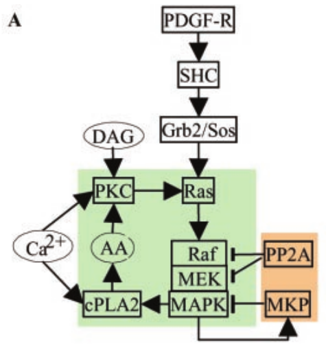
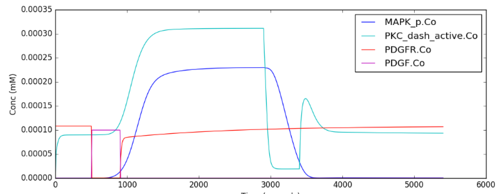

******************
Chemical Bistables
******************

A `bistable system <https://en.wikipedia.org/wiki/Bistability>`_ is a dynamic system that has two stable equilibrium states. The following examples can be used to teach and demonstrate different aspects of bistable systems or to learn how to model them using moose. Each example contains a short description, the model's code, and the output with default settings. 

Each example can be found as a python file within the main moose folder under 
::

    (...)/moose/moose-examples/tutorials/ChemicalBistables

In order to run the example, run the script
::

    python filename.py

in command line, where ``filename.py`` is the name of the python file you would like to run. The filenames of each example are written in **bold** at the beginning of their respective sections, and the files themselves can be found in the aformentioned directory.

In chemical bistable models that use solvers, there are optional arguments that allow you to specify which solver you would like to use.
:: 

    python filename.py [gsl | gssa | ee]

Where:

 - gsl: This is the Runge-Kutta-Fehlberg implementation from the GNU Scientific Library (GSL). It is a fifth order variable timestep explicit method. Works well for most reaction systems except if they have very stiff reactions.
 - gssl: Optimized Gillespie stochastic systems algorithm, custom implementation. This uses variable timesteps internally. Note that it slows down with increasing numbers of molecules in each pool. It also slows down, but not so badly, if the number of reactions goes up.
 - Exponential Euler:This methods computes the solution of partial and ordinary differential equations.

All the following examples can be run with either of the three solvers, each of which has different advantages and disadvantages and each of which might produce a slightly different outcome. 

Simply running the file without the optional argument will by default use the ``gsl`` solver. These ``gsl`` outputs are the ones shown below. 

|
|

MAPK Feedback Model
===================

File name: **mapkFB.py**

This example illustrates loading, and running a kinetic model for a much
more complex bistable positive feedback system, defined in kkit format.
This is based on Bhalla, Ram and Iyengar, Science 2002.

The core of this model is a positive feedback loop comprising of the
MAPK cascade, PLA2, and PKC. It receives PDGF and Ca2+ as inputs.

This model is quite a large one and due to some stiffness in its
equations, it takes about 30 seconds to execute. Note that this is still
200 times faster than the events it models.

The simulation illustrated here shows how the model starts out in a
state of low activity. It is induced to 'turn on' when a a PDGF stimulus
is given for 400 seconds, starting at t = 500s. After it has settled to
the new 'on' state, the model is made to 'turn off' by setting the
system calcium levels to zero. This inhibition starts at t = 2900 and
goes on for 500 s.

Note that this is a somewhat unphysiological manipulation! Following
this the model settles back to the same 'off' state it was in
originally.

**Code:**

.. hidden-code-block:: python
    :linenos:
    :label: Show/Hide code

    #########################################################################
    ## This program is part of 'MOOSE', the
    ## Messaging Object Oriented Simulation Environment.
    ##           Copyright (C) 2014 Upinder S. Bhalla. and NCBS
    ## It is made available under the terms of the
    ## GNU Lesser General Public License version 2.1
    ## See the file COPYING.LIB for the full notice.
    #########################################################################
    
    import moose
    import matplotlib.pyplot as plt
    import matplotlib.image as mpimg
    import pylab
    import numpy
    import sys
    import os
    
    scriptDir = os.path.dirname( os.path.realpath( __file__ ) )
    
    def main():
        """
    This example illustrates loading, and running a kinetic model
    for a bistable positive feedback system, defined in kkit format.
    This is based on Bhalla, Ram and Iyengar, Science 2002.
    
    The core of this model is a positive feedback loop comprising of
    the MAPK cascade, PLA2, and PKC. It receives PDGF and Ca2+ as
    inputs.
    
    This model is quite a large one and due to some stiffness in its
    equations, it runs somewhat slowly.
    
    The simulation illustrated here shows how the model starts out in
    a state of low activity. It is induced to 'turn on' when a
    a PDGF stimulus is given for 400 seconds.
    After it has settled to the new 'on' state, model is made to
    'turn off'
    by setting the system calcium levels to zero for a while. This
    is a somewhat unphysiological manipulation!
    
        """
    
        solver = "gsl"  # Pick any of gsl, gssa, ee..
        #solver = "gssa"  # Pick any of gsl, gssa, ee..
        mfile = os.path.join( scriptDir, '..', '..', 'genesis' , 'acc35.g' )
        runtime = 2000.0
        if ( len( sys.argv ) == 2 ):
            solver = sys.argv[1]
        modelId = moose.loadModel( mfile, 'model', solver )
        # Increase volume so that the stochastic solver gssa
        # gives an interesting output
        compt = moose.element( '/model/kinetics' )
        compt.volume = 5e-19
    
        moose.reinit()
        moose.start( 500 )
        moose.element( '/model/kinetics/PDGFR/PDGF' ).concInit = 0.0001
        moose.start( 400 )
        moose.element( '/model/kinetics/PDGFR/PDGF' ).concInit = 0.0
        moose.start( 2000 )
        moose.element( '/model/kinetics/Ca' ).concInit = 0.0
        moose.start( 500 )
        moose.element( '/model/kinetics/Ca' ).concInit = 0.00008
        moose.start( 2000 )
    
        # Display all plots.
        img = mpimg.imread( 'mapkFB.png' )
        fig = plt.figure( figsize=(12, 10 ) )
        png = fig.add_subplot( 211 )
        imgplot = plt.imshow( img )
        ax = fig.add_subplot( 212 )
        x = moose.wildcardFind( '/model/#graphs/conc#/#' )
        t = numpy.arange( 0, x[0].vector.size, 1 ) * x[0].dt
        ax.plot( t, x[0].vector, 'b-', label=x[0].name )
        ax.plot( t, x[1].vector, 'c-', label=x[1].name )
        ax.plot( t, x[2].vector, 'r-', label=x[2].name )
        ax.plot( t, x[3].vector, 'm-', label=x[3].name )
        plt.ylabel( 'Conc (mM)' )
        plt.xlabel( 'Time (seconds)' )
        pylab.legend()
        pylab.show()
    
    # Run the 'main' if this script is executed standalone.
    if __name__ == '__main__':
            main()
|

**Output:**

