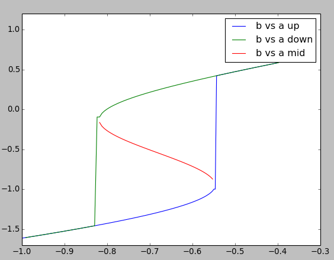
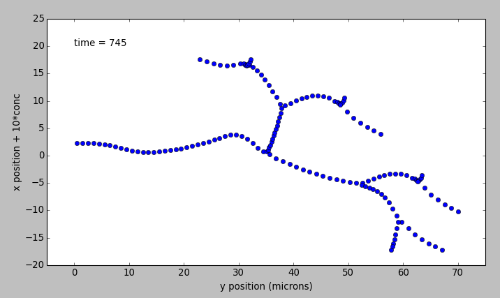

***************
Simple Examples
***************
.. hidden-code-block:: reStructuredText
   :label: How to run these examples

   Each of the following examples can be run by clicking on the green source button
   on the right side of each example, and running from within a ``.py`` python file
   on a computer where moose is installed.

   Alternatively, all the files mentioned on this page can be found in the main
   moose directory. They can be found under 

       (...)/moose/moose-examples/snippets

   They can be run by typing 

       $ python filename.py

   in your command line, where filename.py is the python file you want to run.

   All of the following examples show one or more methods within each python file.
   For example, in the ``cubeMeshSigNeur`` section, there are two blue tabs
   describing the ``cubeMeshSigNeur.createSquid()`` and ``cubeMeshSigNeur.main()``
   methods.

   The filename is the bit that comes before the ``.`` in the blue boxes, with
   ``.py`` added at the end of it. In this case, the file name would be
   ``cubeMeshSigNeur.py``.

Models' Demonstration
---------------------

Oscillation Model
^^^^^^^^^^^^^^^^^

.. automodule:: repressillator
   :members:
   :no-index:

.. automodule:: relaxationOsc
   :members:
   :no-index:

Manipulating Chemical Models
----------------------------

Running with different numerical methods
^^^^^^^^^^^^^^^^^^^^^^^^^^^^^^^^^^^^^^^^

.. automodule:: switchKineticSolvers
   :members:
   :no-index:

Changing volumes
^^^^^^^^^^^^^^^^

.. automodule:: scaleVolumes
   :members:
   :noindex:

Feeding tabulated input to a model
^^^^^^^^^^^^^^^^^^^^^^^^^^^^^^^^^^

.. automodule:: analogStimTable
   :members:
   :no-index:

Finding steady states
^^^^^^^^^^^^^^^^^^^^^

.. automodule:: findChemSteadyState
   :members:
   :no-index:

Making a dose-response curve
^^^^^^^^^^^^^^^^^^^^^^^^^^^^

.. automodule:: chemDoseResponse
   :members:
   :no-index:

Transport in branching dendritic tree
-------------------------------------

.. automodule:: transportBranchingNeuron
   :members:
   :no-index:
