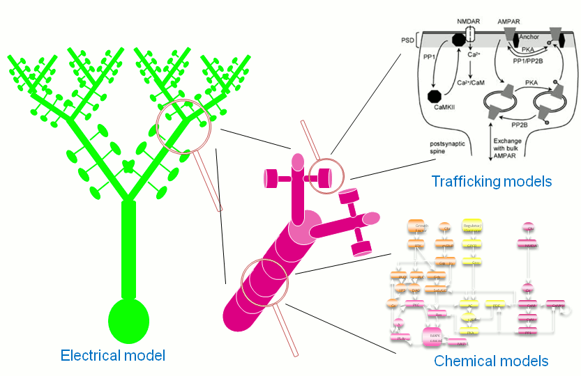

***********************************************
Getting started with python scripting for MOOSE
***********************************************

.. contents::
   :class: this-will-duplicate-information-and-it-is-still-useful-here

   *Multiple scales can be modelled and simulated in MOOSE*

This document describes how to use the ``moose`` module in Python scripts or in an interactive Python shell. It aims to give you enough overview to help you start scripting using MOOSE and extract further information that may be required for advanced work. Knowledge of Python or programming in general will be helpful. In order to simulate existing models in one of the supported formats, you may Use Jardesigner, theweb-based platform. You may load a model file in JSON format using the ``Load Model``  option in the menu. You may then proceed to run the model after setting up the parameters. The results are available in the ``Graph`` option in the display panel. The Jardesigner web platform is equipped with its own documentation, provided as an option in the menu. If you are looking for recipes for specific tasks, take a look at ``Cookbook``. The example code in the boxes can be entered in a Python shell.

MOOSE is based on an object-based approach. Biological concepts are mapped into classes, and a model is built by creating instances of these classes and connecting them by messages. MOOSE Numerical classes aredesigned using efficient data structures and algorithms to handle complex computations with high efficiency. Solver classes in MOOSE seamlessly handle stochastic and deterministic computations arising in biochemistry, reaction-diffusion systems, and even multicompartment neuronal models.

MOOSE provides support for several model formats, including SBML, NeuroML, GENESIS kkit, and cell.p for models, HDF5 and NSDF for data writing. MOOSE uses SI units for all calculations.

Contents:

   :local:
   :depth: 1
      
.. _quickstart-scheduling:

Scheduling
==========

With the model all set up, we have to schedule the
simulation. Different components in a model may have different rates
of update. For example, the dynamics of electrical components require
the update intervals to be of the order 0.01 ms whereas chemical
components can be as slow as 1 s. Also, the results may depend on the
sequence of the updates of different components. These issues are
addressed in MOOSE using a clock-based update scheme. Each model
component is scheduled on a clock tick (think of multiple hands of a
clock ticking at different intervals and the object being updated at
each tick of the corresponding hand). The scheduling also guarantees
the correct sequencing of operations. For example, your Table objects
should always be scheduled *after* the computations that they are
recording, otherwise they will miss the outcome of the latest calculation.

MOOSE has a central clock element (``/clock``) to manage
time. Clock has a set of ``Tick`` elements under it that take care of
advancing the state of each element with time as the simulation
progresses. Every element to be included in a simulation must be
assigned a tick. Each tick can have a different ticking interval
(``dt``) that allows different elements to be updated at different
rates.

By default, every object is assigned a clock tick with reasonable
default timesteps as soon it is created. There are 32 available clock
ticks. In most simulations you need only a few.

If you want fine control over the scheduling, there are three things
you can do.

    * Alter the `tick` field on the object
    * Alter the `dt` associated with a given tick, using the
      **moose.setClock( tick, newdt)** command
    * Go through a wildcard path of objects reassigning there clock ticks,
      using **moose.useClock( path, newtick, function)**.

Here we discuss these in more detail.

**Altering the 'tick' field**

Every object knows which tick and dt it uses::

    >>> a = moose.Table( '/a' )
    >>> print(a.tick, a.dt)
    8 0.0001

The ``tick`` field on every object can be changed, and the object will
adopt whatever clock dt is used for that tick. The ``dt`` field is
readonly, because changing it would have side-effects on every object
associated with the current tick.

Ticks **-1** and **-2** are special: They both tell the object that it is
disabled (not scheduled for any operations). An object with a
tick of **-1** will be left alone entirely. A tick of **-2** is used in
solvers to indicate that should the solver be removed, the object will
revert to its default tick.

**Altering the dt associated with a given tick**

We initialize the ticks and set their ``dt`` values using the
``setClock`` function. ::

        >>> moose.setClock(0, 0.025e-3)
        >>> moose.setClock(1, 0.025e-3)
        >>> moose.setClock(2, 0.25e-3)

This will initialize tick #0 and tick #1 with ``dt = 25`` μs and tick #2
with ``dt = 250`` μs. Thus all the elements scheduled on ticks #0 and 1
will be updated every 25 μs and those on tick #2 every 250 μs. We use
the faster clocks for the model components where finer timescale is
required for numerical accuracy and the slower clock to sample the
values of ``Vm``.

Note that if you alter the dt associated with a given tick, this will
affect the update time for *all* the objects using that clock tick. If
you're unsure that you want to do this, use one of the vacant ticks.

**Assigning clock ticks to all objects in a wildcard path**

To assign tick #2 to the table for recording ``Vm``, we pass its
whole path to the ``useClock`` function. ::

        >>> moose.useClock(2, '/data/soma_Vm', 'process')

Read this as "use tick # 2 on the element at path ``/data/soma_Vm`` to
call its ``process`` method at every step". Every class that is supposed
to update its state or take some action during simulation implements a
``process`` method. And in most cases that is the method we want the
ticks to call at every time step. A less common method is ``init``,
which is implemented in some classes to interleave actions or updates
that must be executed in a specific order [4]_. The ``Compartment``
class is one such case where a neuronal compartment has to know the
``Vm`` of its neighboring compartments before it can calculate its
``Vm`` for the next step. This is done with: ::

        >>> moose.useClock(0, soma.path, 'init')

Here we used the ``path`` field instead of writing the path explicitly.

Next we assign tick #1 to process method of everything under ``/model``. ::

        >>> moose.useClock(1, '/model/##', 'process')

Here the second argument is an example of wild-card path. The ``##``
matches everything under the path preceding it at any depth. Thus if we
had some other objects under ``/model/soma``, ``process`` method of
those would also have been scheduled on tick #1. This is very useful for
complex models where it is tedious to scheduled each element
individually. In this case we could have used ``/model/#`` as well for
the path. This is a single level wild-card which matches only the
children of ``/model`` but does not go farther down in the hierarchy.

.. _quickstart-running:

Running the simulation
======================

Once the model is all set up, we can put the model to its
initial state using ::

        >>> moose.reinit()

You may remember that we had changed initVm from ``-0.06`` to ``-0.07``.
The reinit call we initialize ``Vm`` to that value. You can verify that ::

        >>> print(soma.Vm)
        -0.07

Finally, we run the simulation for 300 ms ::

        >>> moose.start(300e-3)

The data will be recorded by the ``soma_vm`` table, which is referenced
by the variable ``vmtab``. The ``Table`` class provides a numpy array
interface to its content. The field is ``vector``. So you can easily plot
the membrane potential using the `matplotlib <https://matplotlib.org/>`__
library. ::

        >>> import pylab
        >>> t = pylab.linspace(0, 300e-3, len(vmtab.vector))
        >>> pylab.plot(t, vmtab.vector)
        >>> pylab.show()

The first line imports the pylab submodule from matplotlib. This useful
for interactive plotting. The second line creates the time points to
match our simulation time and length of the recorded data. The third
line plots the ``Vm`` and the fourth line makes it visible. Does the
plot match your expectation?

.. _quickstart-details:

Some more details
=================

``vec``, ``melement`` and ``element``
-----------------------------------------

MOOSE elements are instances of the class ``melement``. ``Compartment``,
``PulseGen`` and other MOOSE classes are derived classes of
``melement``. All ``melement`` instances are contained in array-like
structures called ``vec``. Each ``vec`` object has a numerical
``id_`` field uniquely identifying it. An ``vec`` can have one or
more elements. You can create an array of elements ::

        >>> comp_array = moose.vec('/model/comp', n=3, dtype='Compartment')

This tells MOOSE to create an ``vec`` of 3 ``Compartment`` elements
with path ``/model/comp``. For ``vec`` objects with multiple
elements, the index in the ``vec`` is part of the element path. ::

        >>> print(comp_array.path, type(comp_array))

shows that ``comp_array`` is an instance of ``vec`` class. You can
loop through the elements in an ``vec`` like a Python list ::

        >>> for comp in comp_array:
        ...    print(comp.path, type(comp))
	...

shows ::

        /model[0]/comp[0] <type 'moose.Compartment'>
        /model[0]/comp[1] <type 'moose.Compartment'>
        /model[0]/comp[2] <type 'moose.Compartment'>

Thus elements are instances of class ``melement``. All elements in an
``vec`` share the ``id_`` of the ``vec`` which can retrieved by
``melement.getId()``.

A frequent use case is that after loading a model from a file one knows
the paths of various model components but does not know the appropriate
class name for them. For this scenario there is a function called
``element`` which converts ("casts" in programming jargon) a path or any
moose object to its proper MOOSE class. You can create additional
references to ``soma`` in the example this way ::

        x = moose.element('/model/soma')

Any MOOSE class can be extended in Python. But any additional attributes
added in Python are invisible to MOOSE. So those can be used for
functionalities at the Python level only. You can see
``moose-examples/squid/squid.py`` for an example.

``Finfos``
----------

The following kinds of ``Finfo`` are accessible in Python

-  **``valueFinfo``** : simple values. For each readable ``valueFinfo``
   ``XYZ`` there is a ``destFinfo`` ``getXYZ`` that can be used for
   reading the value at run time. If ``XYZ`` is writable then there will
   also be ``destFinfo`` to set it: ``setXYZ``. Example:
   ``Compartment.Rm``
-  **``lookupFinfo``** : lookup tables. These fields act like Python
   dictionaries but iteration is not supported. Example:
   ``Neutral.neighbors``.
-  **``srcFinfo``** : source of a message. Example:
   ``PulseGen.output``.
-  **``destFinfo``** : destination of a message. Example:
   ``Compartment.injectMsg``. Apart from being used in setting up
   messages, these are accessible as functions from Python.
   ``HHGate.setupAlpha`` is an example.
-  **``sharedFinfo``** : a composition of source and destination fields.
   Example: ``Compartment.channel``.

.. _quickstart-moving-on:

Moving on
=========

Now you know the basics of pymoose and how to access the help
system. You can figure out how to do specific things by looking at the
'cookbook`.  In addition, the ``moose-examples/snippets`` directory
in your MOOSE installation has small executable python scripts that
show usage of specific classes or functionalities. Beyond that you can
browse the code in the ``moose-examples`` directory to see some more complex
models.

MOOSE is backward compatible with GENESIS and most GENESIS classes have
been reimplemented in MOOSE. There is slight change in naming (MOOSE
uses CamelCase), and setting up messages are different. But `GENESIS
documentation <http://www.genesis-sim.org/GENESIS/Hyperdoc/Manual.html>`__
is still a good source for documentation on classes that have been
ported from GENESIS.

If the built-in MOOSE classes do not satisfy your needs entirely, you
are welcome to add new classes to MOOSE. The API documentation will
help you get started.

.. [1]
   To list the classes only, use ``moose.le('/classes')``

.. [2]
   MOOSE is unit agnostic and things should work fine as long as you use
   values all converted to a consistent unit system.

.. [3]
   This apparently convoluted implementation is for performance reason.
   Can you figure out why? *Hint: the table is driven by a slower clock
   than the compartment.*

.. [4]
   In principle any function available in a MOOSE class can be executed
   periodically this way as long as that class exposes the function for
   scheduling following the MOOSE API. So you have to consult the class'
   documentation for any nonstandard methods that can be scheduled this
   way.
