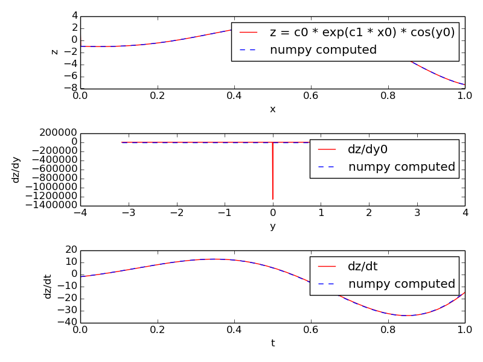

*************
MOOSE Classes
*************

.. toctree::
   :maxdepth: 2

.. automodule:: onetoonemsg
   :members:
   :no-index:

Show the message
""""""""""""""""

.. automodule:: showmsg
  :members:
  :no-index:

Single Message Cross
""""""""""""""""""""

.. automodule:: singlemsgcross
  :members:
  :no-index:

Time
^^^^

Clocks
""""""

.. automodule:: showclocks
  :members:
  :no-index:

Generating Time Data Table
""""""""""""""""""""""""""

.. automodule:: timetable
  :members:
  :no-index:

Vectors
^^^^^^^

.. automodule:: vectors
  :members:
  :no-index:

Data Entries
^^^^^^^^^^^^

.. automodule:: wildcard
  :members:
  :no-index:

Interpolation
^^^^^^^^^^^^^

1-dimentional Interpolation
"""""""""""""""""""""""""""

.. automodule:: interpol
  :members:
  :no-index:

.. literalinclude:: ../../../../moose-examples/snippets/interpol.py
   :language: python
   :end-before: # block 1 end

.. literalinclude:: ../../../../moose-examples/snippets/loadKineticModel.py
   :language: python
   :end-before: # block 2 end

2-dimentional interpolation
"""""""""""""""""""""""""""

.. automodule:: interpol2d
   :members:
   :no-index:
.. literalinclude:: ../../../../moose-examples/snippets/interpol2d.py
   :language: python
   :end-before: # block 1 end 

SymCompartment
^^^^^^^^^^^^^^

.. automodule:: symcompartment
  :members:
  :no-index:

Tables
^^^^^^

.. automodule:: tabledemo
  :members:
  :no-index:

Data Types
^^^^^^^^^^

HDF DataType
""""""""""""

.. automodule:: hdfdemo
   :members:

NSDF DataType
"""""""""""""

.. automodule:: nsdf
   :members:

.. automodule:: nsdf_vec
   :members:

PyMoose
^^^^^^^

.. automodule:: traub_naf
   :members:

This is an example showing pymoose implementation of the NaF channel in Traub et al 2005

Author: Subhasis Ray

traub_naf.create_compartment(parent_path, name)[source]
This shows how to use the prototype channel on a compartment.

traub_naf.create_naf_proto()[source]
Create an NaF channel prototype in /library. You can copy it later into any compartment or load a .p file with this channel using loadModel.

This channel has the conductance form:

Gk(v) = Gbar * m^3 * h (V - Ek)
We are using all SI units

traub_naf.do_iclamp(vclamp, iclamp, pid)[source]
Turn on current clamp and turn off voltage clamp

traub_naf.do_vclamp(vclamp, iclamp, pid)[source]
Turn on voltage clamp and turn off current clamp

traub_naf.run_clamp(model_dict, clamp, levels, holding=0.0, simtime=0.1)[source]
Run either voltage or current clamp for default timing settings with multiple levels of command input.

model_dict: dictionary containing the model components -

vlcamp - the voltage clamp amplifier

iclamp - the current clamp amplifier

model - the model container

data - the data container

inject_tab - table recording membrane

command_tab - table recording command input for voltage or current clamp

vm_tab - table recording membrane potential

clamp: string specifying clamp mode, either voltage or current

levels: sequence of values for command input levels to be simulated

holding: holding current or voltage

Returns: a dict containing the following lists of time series:

command - list of command input time series

inject - list of of membrane current (includes injected current) time series

vm - list of membrane voltage time series

t - list of time points for all of the above

traub_naf.run_sim(model, data, simtime=0.1, simdt=1e-06, plotdt=0.0001, solver='ee')[source]
Reset and run the simulation.

model: model container element

data: data container element

simtime: simulation run time

simdt: simulation timestep

plotdt: plotting time step

solver: neuronal solver to use

traub_naf.setup_electronics(model_container, data_container, compartment)[source]
Setup voltage and current clamp circuit using DiffAmp and PID and RC filter

traub_naf.setup_model()[source]
Setup the model and the electronic circuit. Also creates the data container.

.. _quickstart-maths:

Mathematics with MOOSE
^^^^^^^^^^^^^^^^^^^^^^

Computing an arbitrary function
^^^^^^^^^^^^^^^^^^^^^^^^^^^^^^^

.. automodule:: function
  :members:

Computing an arbitrary function

function.example()[source]

Function objects can be used to evaluate expressions with arbitrary number of variables and constants. We can assign expression of the form:

f(c0, c1, ..., cM, x0, x1, ..., xN, y0,..., yP )
where c_i's are constants and x_i's and y_i's are variables.

The constants must be defined before setting the expression and variables are connected via messages. The constants can have any name, but the variable names must be of the form x{i} or y{i} where i is increasing integer starting from 0.

The x_i's are field elements and you have to set their number first (function.x.num = N). Then you can connect any source field sending out double to the 'input' destination field of the x[i].

The y_i's are useful when the required variable is a value field and is not available as a source field. In that case you connect the requestOut source field of the function element to the get{Field} destination field on the target element. The y_i's are automatically added on connecting. Thus, if you call:

moose.connect(function, 'requestOut', a, 'getSomeField')
moose.connect(function, 'requestOut', b, 'getSomeField')
then a.someField will be assigned to y0 and b.someField will be assigned to y1.

In this example we evaluate the expression: z = c0 * exp(c1 * x0) * cos(y0)

with x0 ranging from -1 to +1 and y0 ranging from -pi to +pi. These values are stored in two stimulus tables called xtab and ytab respectively, so that at each timestep the next values of x0 and y0 are assigned to the function.

Along with the value of the expression itself we also compute its derivative with respect to y0 and its derivative with respect to time (rate). The former uses a five-point stencil for the numerical differentiation and has a glitch at y=0. The latter uses backward difference divided by dt.

Unlike Func class, the number of variables and constants are unlimited in Function and you can set all the variables via messages.

Harmonic Oscillatory Function
^^^^^^^^^^^^^^^^^^^^^^^^^^^^^

.. automodule:: funcRateHarmonicOsc
  :members:

Lotka-Voltera Model
^^^^^^^^^^^^^^^^^^^

.. automodule:: funcReacLotkaVolterra
  :members:

.. automodule:: stochasticLotkaVolterra
  :members:

Vary Concentration with mathematical function
^^^^^^^^^^^^^^^^^^^^^^^^^^^^^^^^^^^^^^^^^^^^^

.. automodule:: funcInputToPools
  :members:
