Interface
---------

.. toctree::
   :maxdepth: 3

The interface layout consists of a `menu bar` with twelve options pertaining to different aspects of model building. There are tabs for Graph, JSON model, Documentation, Setup 3D, and Run3D on the display panel on the right of the interface . The left appears with tab options for each item selected from the menu bar.

Menu Bar
~~~~~~~~
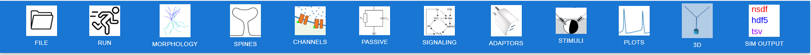

The menu bar appears at the top of the main window.It consists of the following options:      

`File <#TOC>`__
~~~~~~~~~~~~~~~
The `File` menu option provides the following sub-options:

-  `Save Current Model Config <#file-save-current-model-config>`_ - This panel option is for configuring a model with model name, author's name, license and model notes with a `Save Model` button in .json format.
-  `Load Model Config <#file-load-model-config>`_ - This panel option has a `Load Model` button which when clicked opens a window for the user's current directory, to load files in the .json format.
-  `Clear Model <#clear-model>`_ - This panel option has a `Clear Model` button to clear current model configurations.

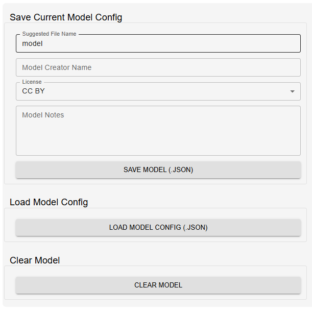

`Run <#TOC>`__
~~~~~~~~~~~~~~
The `Run` dialog has the following options:

 - `Total runtime` - Total time that the simulation will run for.
 - `Current time` - Current time updates as the model runs on the server.
 - `Simulation Time Steps (Clocks)` - This option has further suboptions for assigning values to `Elec Dt`, `Elec Plot Dt`, `Chem Dt`, `Chem Plot Dt`, `function Dt`, `Diffusion Dt`, and `Status Dt` to set up the simulation.
 - `Configuration settings` - Has suboptions for Flags to `Turn Off Elec`, `Use GSSA`, `Combine segments`, `Reuse Library cells`. There are further suboptions under `Other settings` for `model path`,Rand seed, Temperature , and ODE method.
   
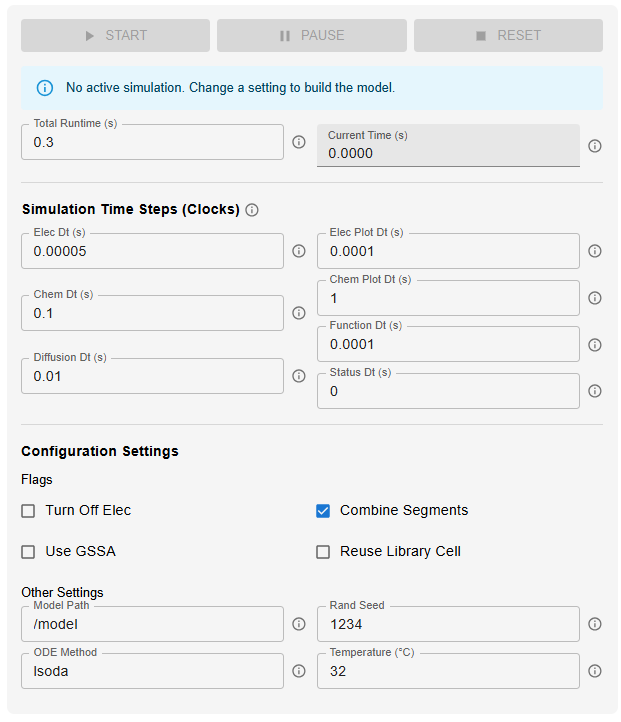

`Morphology <#TOC>`__
~~~~~~~~~~~~~~~~~~~~~
The Morphology dialog has the following options:

 - `File`- Selects morphology file from the user's local file system. Accepatable formats include .swc, .hoc.

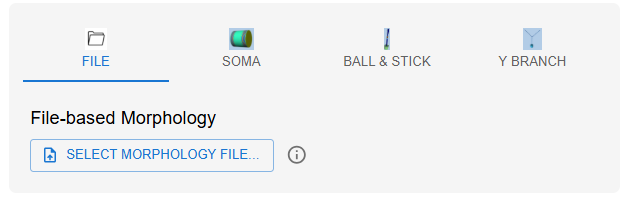

- `Soma`- Creates a `soma` with given length and diameter. For a spherical soma, the length and diameter should be the same.

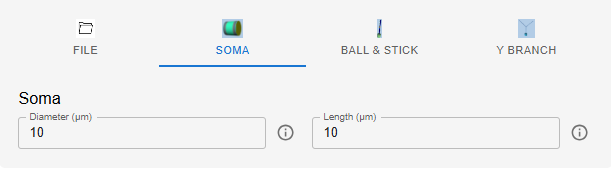

- `Ball and Stick`- Creates a `ball` for the soma and a `stick` for the dendrite. 

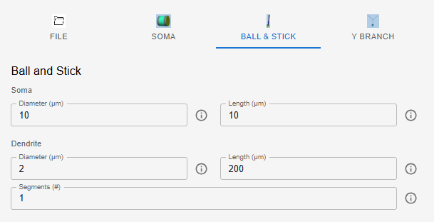

- `Y Branch`- for a Y-shaped neuron.

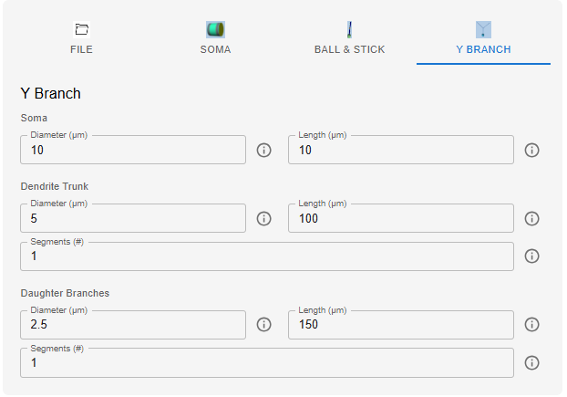
   
`Spines <#TOC>`__
~~~~~~~~~~~~~~~~~

This dialog lets the user select for the type and distribution of spines to be inserted.

 - `Prototypes` -  The kinds of spines range from excitatory, with or without calcium, passive as well as defined by user function. Note that everytime a new protype is to be created the `+` icon should be clicked instead of overriding the parameters for the existing prototype.

 .. figure:: ../../../../images/jardesigner_spines_prototype.png
  :align: center
  :scale: 75%
  :alt: Jardesigner Spines

- `Distributions` - These determine the spatial arrangement of spine insertion.

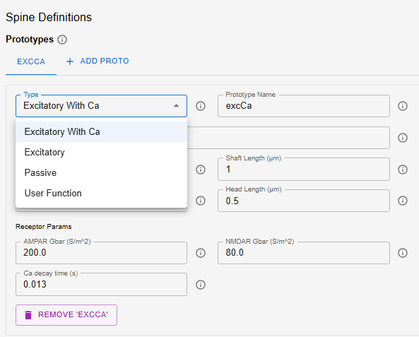

`Channels <#TOC>`__
~~~~~~~~~~~~~~~~~~~
This diailog lets the user select for the type and distribution of channels from a repertoire as provided in the options.

- `Prototypes` - List of predefined channels. Note that everytime a new protype is to be created the `+` icon should be clicked instead of overriding the parameters for the existing prototype.

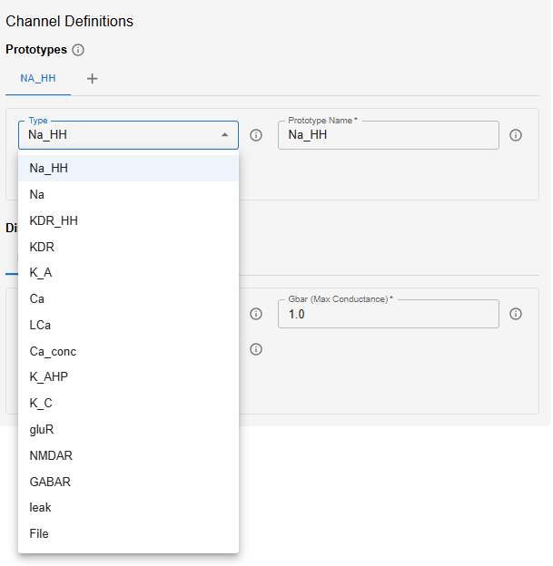

- `Distributions` - Once the prototype is decided, the location of the channels in the morphological path and the maximum conductance density at this location can be specified for channel distribution.

 .. figure:: ../../../../images/jardesigner_channels_distribution.png
  :align: center
  :scale: 75%
  :alt: Jardesigner Channels

`Passive <#TOC>`__
~~~~~~~~~~~~~~~~~~
This dialog describes the passive electrical properties of the membrane, which apply uniformly to all parts of the neuron unless overridden by another distribution rule.

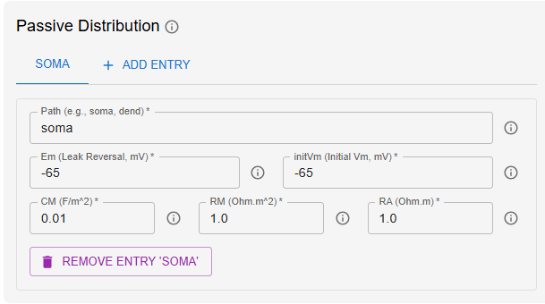

`Signaling <#TOC>`__
~~~~~~~~~~~~~~~~~~~~
The chemical signaling dialog has options for different kinds of prototypes and also options to load from file in SBML and kkit formats as well as their distributions.

- `Protoypes` - List of chemical signaling pathways, molecules and systems. 

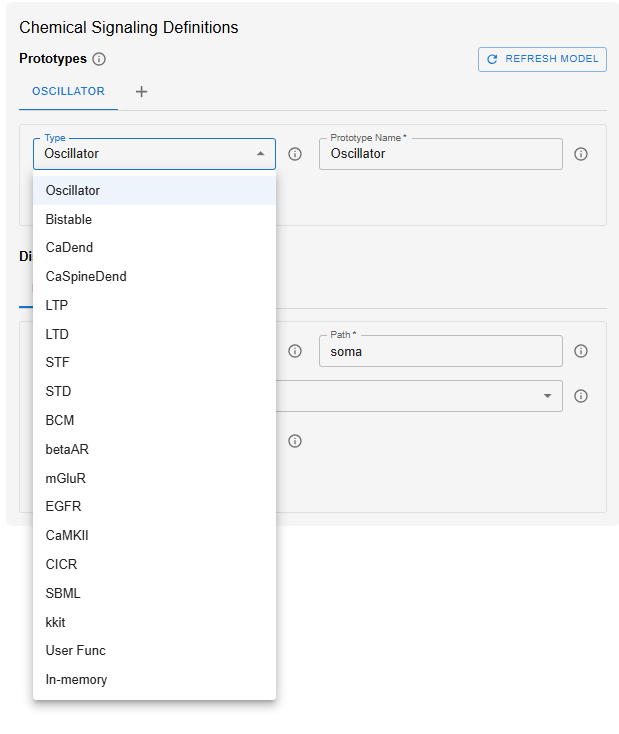

- `Distributions` - This option lets you set up the chemical signaling system in neuron by specifying the chemical compartment, morphological path,location and the diffusion Length.

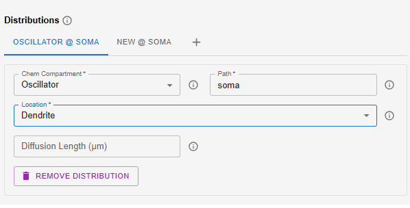

`Adaptors <#TOC>`__
~~~~~~~~~~~~~~~~~~~
Adaptors are crucial for the multiscale modelling of Jardesigner. The Adaptor class in MOOSE handles the coupling of chemical and eletrical events in the sense of how chemical events influence an electrical model or how electrical events affect a chemical signalling pathway.The adaptor has a `source path`, an input to the adaptor,and a `destination path`, which is the field that is being `influenced` or modified. The dialog has options for `Source Field` and `Destination Field`. The next option is the crucial part of the adaptor dialog, the linear transformation,with options for `baseline` and `slope`. This is the mapping that connects the electrical and chemical components in a multiscale neuronal model. For example, if some protein molecule is modulating a particular channel conductivity, then the `slope` signifies the x-fold change in conductance of the channel.

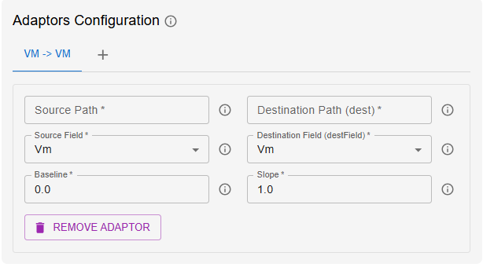

How do they work?
^^^^^^^^^^^^^^^^^
The adaptors work on the visible fields of objects which is facilitated by the messaging system of MOOSE. It is important to take note that chemical and electrical events involve different time scales and this is handled by the clock-based scheduling system of MOOSE. The solvers or numerical engines update the objects in a behind-the-scenes manner, thus enabling the adaptor objects to seamlessly map the `Source field` to the `Destination field` for effective multiscale modelling.

Example1 : Calcium mapping
^^^^^^^^^^^^^^^^^^^^^^^^^^
Calcium is computed in the electrical solver as one or more pools that are fed by calcium currents, and is removed by an exponential decay process. This calcium pool is non-diffusive in the current electrical solver. It has to be mapped to chemical calcium pools at a different spatial discretization, which do diffuse.

**Implementation** :

1. The electrical model is partitioned into a number of electrical compartments, some of which have the 'electrical' calcium pool as child object in a UNIX filesystem-like tree. Thus the 'electrical' calcium represented as an object with concentration, location and so on.
  	
2. The Solver computes the time-course of evolution of the calcium concentration. Whenever any function queries the `concentration` field of the calcium object, the Solver provides this value.

3. Messaging couples the 'electrical' calcium pool concentration to the adaptor. This can either be a 'push' operation, where the solver pushes out the calcium value at its internal update rate, or a 'pull' operation where the adaptor requests the calcium concentration.

4. The clock-based scheduler keeps the electrical and chemical solvers ticking away, but it also can drive the operations of the adaptor. Thus the rate of updates to and from the adaptor can be controlled.

5. The adaptor averages its inputs. Say the electrical solver is going at a timestep of 50 usec, and the chemical solver at 5000 usec. The adaptor will take 100 samples of the electrical concentration, and average them to compute the 'input' to the linear scaling. Suppose that the electrical model has calcium units of micromolar, but has a zero baseline. The chemical model has units of millimolar and a baseline of 1e-4 millimolar. This gives:
::
   
       y = 0.001x + 1e-4
  
At the end of this calculation, the adaptor will typically 'push' its output to the chemical solver. Here we have similar situation to item (1), where the chemical entities are calcium pools in space, each with their own calcium concentration.The messaging (3) determines another aspect of the mapping here: the fan in or fan out. In this case, a single electrical compartment may house 10 chemical compartments. Then the output message from the adaptor goes to update the calcium pool concentration on the appropriate 10 objects representing calcium in each of the compartments.

Example2 : Regulation of channel properties by Phosphorylation
^^^^^^^^^^^^^^^^^^^^^^^^^^^^^^^^^^^^^^^^^^^^^^^^^^^^^^^^^^^^^^
In much the same manner, the phosphorylation state can regulate channel properties.

1. The chemical model contains spatially distributed chemical pools that represent the unphosphorylated state of the channel, which in this example is the conducting form. This concentration of this unphosphorylated state is affected by the various reaction-diffusion events handled by the chemical solver, below.

2. The chemical solver updates the concentrations of the pool objects as per reaction-diffusion calculations.

3. Messaging couples these concentration terms to the adaptor. In this case we have many chemical pool objects for every electrical compartment. There would be a single adaptor for each electrical compartment, and it would average all the input values for calcium concentration, one for each mesh point in the chemical calculation. As before, the access to these fields could be through a 'push' or a 'pull' operation.

4. The clock-based scheduler oeperates as above.

5. The adaptor averages the spatially distributed inputs from calcium, and now does a different linear transform. In this case it converts chemical concentration into the channel conductance. As before, the 'electrical' channel is an object (point 1) with a field for conductance, and this term is mapped into the internal data structures of the solver (point 2) invisibly to the user.
    
`Stimuli <#TOC>`__
~~~~~~~~~~~~~~~~~~
The dialog offers options for a set of possible kinds of stimulations depending on the location as well as whther it is electrical stimulus or chemical.

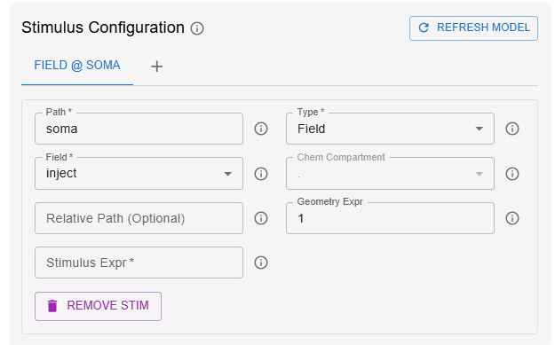

- `Path` - This is to determine the exact location of the stimulus.
- `Field` - This tells the GUI whether it is a periodic synapse or random synapse. This could be left unchanged for models which does not require such options.
- `Inject` - This provides several options for stimulus injection categorised under electrical and chemical stimuli. The electrical stimuli options offer vclamp, activation and modulation options. The chemical stimuli category offers conc, concInit, n and nInit. 

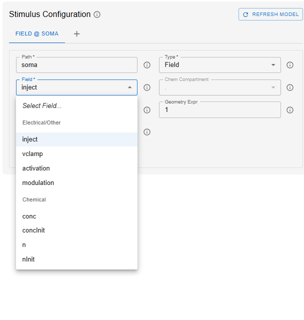
  
- `Stimulus Expr` - This is the expression that defines the stimulus. The variable involved is typically `time t`. This could be as complicated as one would like the stimulus to be.
  
`Plots <#TOC>`__
~~~~~~~~~~~~~~~~
This dialog configurations caters to options for plotting results of the simulation performed. The dialog has the following options:

- `Path` - The path determines the location from which data should be retrieved for plotting.

- `Field` - This is to determine the specific field or variable to be plotted.

- `Title` - To provide a title to your plot. This is optional.

- `Mode` - The type of plot to generate. The various mode options are time, space, wave and raster.

- `Y min` - Option minimum value of Y-axis. If default is set to zero, the minimum value is determined automatically.

- `Y max` - Option for maximum value for Y-axis. If default is set to zero, the maximum value is automatically determined.

- `#Wave Frames` - The number of frames for an animated wave plot.

The ouput plots are gerenerated using plotly and one can zoom in and save the data.

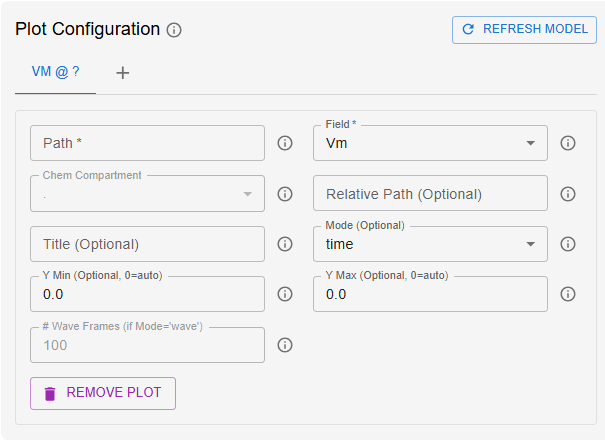

`3D Visualization(Moogli) <#TOC>`__
~~~~~~~~~~~~~~~~~~~~~~~~~~~~~~~~~~~
The 3D visualization dialog has two sub-configuration options:

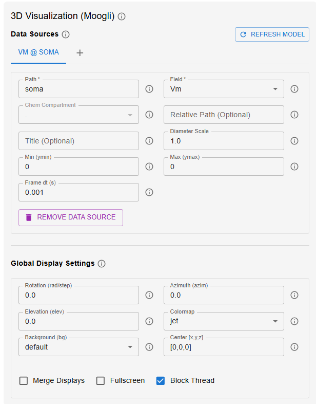

- `Data Sources` - This configuration tab is for the `Fields` to be visualized. This has options for `Path`, `Field`, `Title`, `diameter scale` for scaling the morphology, `ymin`, `ymax` and `frame dt`.

- `Global Display settings` - This configuration has options for `rotation`, `azimuth`, `elevation`, `colormap`, `background` and `centre`. 

Further options for 

- `Merge display` - All adat sources are combined intoa single 3D display.

- `Fullscreen` - 3D window will open in fullscreen mode.

- `Block thread` - If checked,the main process will wait for the 3D window to be closed. If unchecked, the simulation can run in the background.

`SIM OUTPUT <#TOC>`__
~~~~~~~~~~~~~~~~~~~~~
This tab provides options for data formats for saving the data. The data formats supported are nsdf, hdf5,tsv, csv, xml. The dialog has the following options:

- `Output Filename` - To name the output file.

- `File type` - The various data formats.

- `Data source path` - The location for data retrieval.

- `Data source field` - The field type for which the value is recorded.

- `Sampling interval` - time step for saving data in seconds.

- `Flush interval` - The number of time steps after which data is written.

`Display Settings <#TOC>`__
~~~~~~~~~~~~~~~~~~~~~~~~~~~
The display tab on the right hand side of the GUI has dialog for Graphs, JSON Model, Documentation, Setup 3D and Run3D.

`Graphs <#TOC>`__
^^^^^^^^^^^^^^^^^^
This displays the resultant plots and graphs after the simulation has concluded.

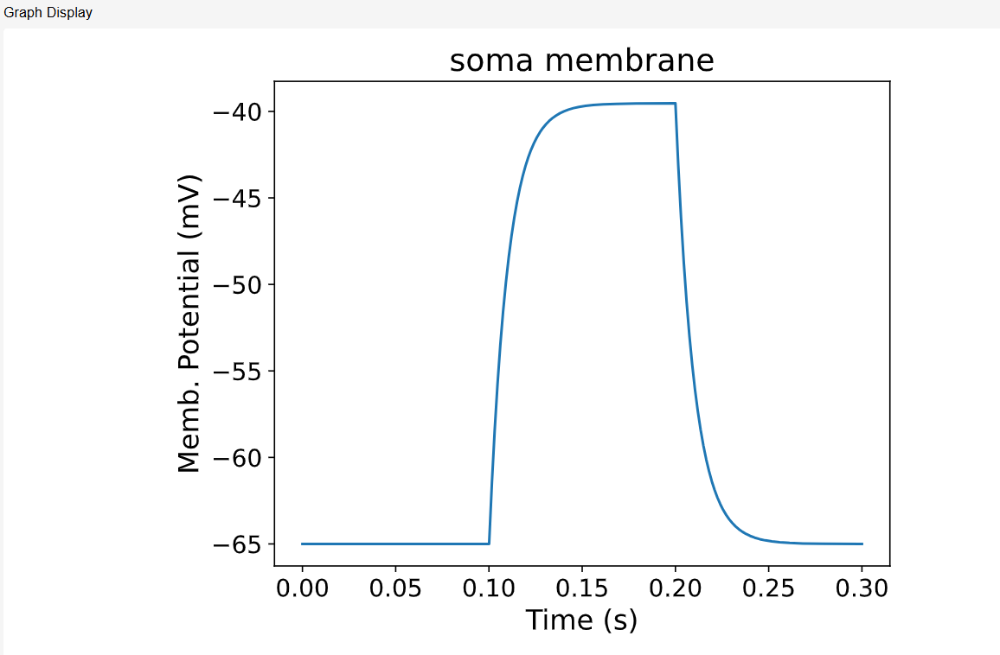

`JSON Model <#TOC>`__
^^^^^^^^^^^^^^^^^^^^^^
The JSON Model tab shows the model as it is getting built. Note that the model is rebuilt on menu-close. The `Show Model JSON` button when clicked displays the model built in the JSON Format. Following is an example :

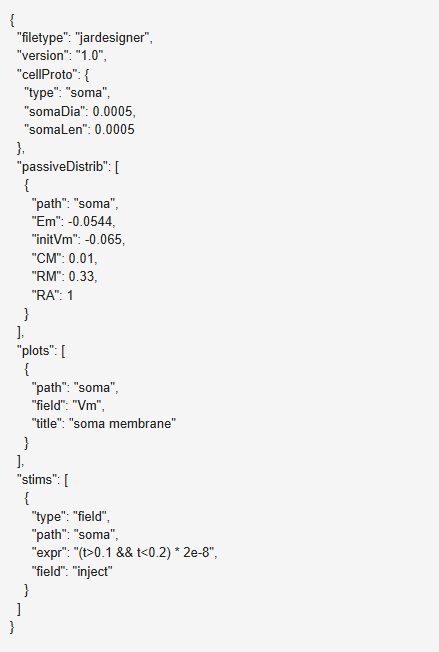

`Documentation <#TOC>`__
^^^^^^^^^^^^^^^^^^^^^^^^^
This tab opens up the documentation for the GUI.

`SetUp 3D <#TOC>`__
^^^^^^^^^^^^^^^^^^^
When a model is loaded or is built from the scratch, this dialog shows the 3D model of the model.On the left top corner there is a tab for `Selected path` which provides an option for the part of the model to be displayed for. On the right top corner of the view tab there is a tool bar with options for 3D view

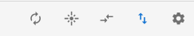

The icons represent the following functions:

-  |image0| - Auto-rotate

-  |image1| - Toggle reflectivity

-  |image2| - Flipview

-  |image3| - Vertical Axis Y

-  |image4| - View options

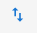

The viewoptions has further details pertaining to visible readouts, readout colorbar range and explode-cell-on-axis.

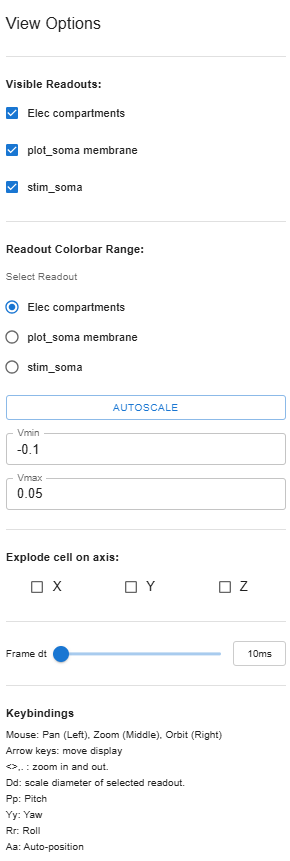

`Run 3D <#TOC>`__
^^^^^^^^^^^^^^^^^
The Run 3D option is to visualize the simulation as it is taking place.

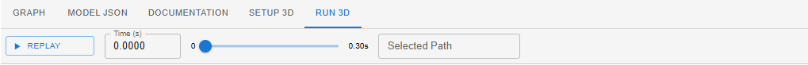

There are options for `Replay`, `Time`, and `Selected path`.
